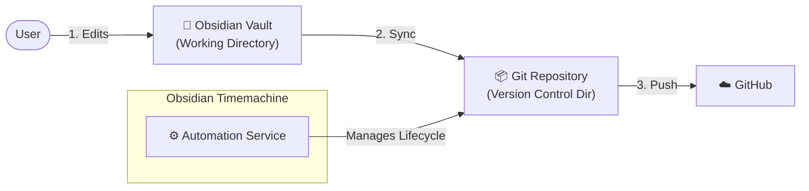

# Obsidian-Timemachine 

[中文文档](README.zh.md) | [Documentation](docs/Doc.md)

**A "Set and Forget" automated backup solution for your Obsidian Vault.**

Unlike internal plugins, **Obsidian-Timemachine** runs as a system-level background process. It automatically syncs your vault (from iCloud Drive or any local path) to a Git repository and pushes changes to GitHub, ensuring your data is safe even if you never open Obsidian.

##  Features

- **Background Automation**: Runs silently via Cron. You focus on writing; we handle the saving.
- **Dual Modes**:
    1.  **Direct Mode**: Directly manages your local vault with Git.
    2.  **Mirror Mode (Best for iCloud)**: Uses `rsync` to mirror your iCloud vault to a separate local Git repo, preventing iCloud sync conflicts from corrupting your Git history.
- **Secure**: Sensitive configuration (paths, SSH keys) is completely separated from the code.
- **Smart Logging**: Auto-rotates logs and keeps your system clean.

## Architecture



##  Why Obsidian-Timemachine?

While plugins like *obsidian-git* are great, **Obsidian-Timemachine** offers distinct advantages for data safety:

| Feature |  Obsidian Plugins | ️ Obsidian-Timemachine |
| :--- | :--- | :--- |
| **Dependency** | **Must open Obsidian** to trigger backup. | **Zero dependency.** Runs in background (cron) even if Obsidian is closed. |
| **Performance** | Uses JS-based Git (slower for large vaults). | Uses **Native Git & Rsync** (fast, efficient, stable). |
| **Safety** | Direct Git ops in sync folders (risk of conflicts). | **Separation mode**: Mirrors source to a clean Git repo via Rsync. |
| **Philosophy** | "Version Control Tool" | **"Automated Disaster Recovery"** |


##  Installation

**One-click Installation:**
```bash
/bin/bash -c "$(curl -fsSL https://raw.githubusercontent.com/StrongTechProject/Obsidian-Timemachine/main/src/install.sh)"
```

After installation, type `obsis` in your terminal to launch the **Time Machine Control Panel**.

##  Quick Start

1.  **Setup Wizard (Full Initialization)**:
    Run `obsis` and select **Option 1 (Quick Start)**. This guided wizard will:
    *   Prompt for your **Obsidian Vault Path (Source)**.
    *   Define the **Git Repository Path (Destination)**.
    *   Configure your **SSH Key** for GitHub (auto-detects or generates).
    *   Help you **set the auto-sync frequency (the "Time Machine" part)**, making it truly "set and forget".

2.  **Modify Existing Configuration**:
    If you need to change previously set options (like sync frequency or paths), use **Option 3 (Configure options)** from the main menu.

3.  **Manual Run**:
    ```bash
    ./src/sync_and_push.sh
    ```

## Prerequisites
- **Git & GitHub Account**
- **SSH Key**: [Beginner's Guide to SSH Key Configuration](docs/Git_SSH_Config_Guide.md)