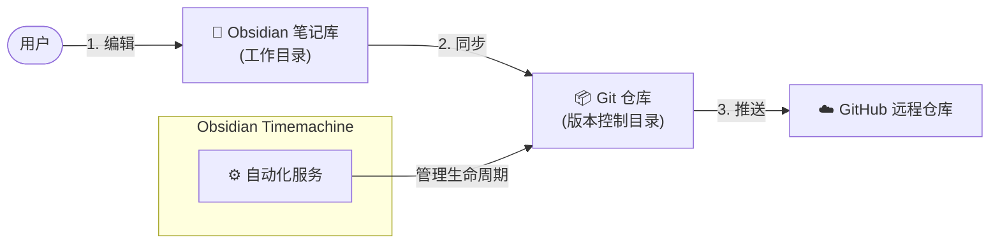

# Obsidian-Timemachine 

[English README](README.md) | [详细文档](docs/zh/Doc.zh.md)

**一款“配置即遗忘 (Set and Forget)”的 Obsidian 自动化备份与版本管理方案。**

与应用内插件不同，**Obsidian-Timemachine** 是一个系统级的后台服务。无论你是否打开 Obsidian，它都会默默地将你的笔记库（支持 iCloud 或本地目录）同步并推送到 GitHub。它就像“时光机”一样，守护你的每一次灵感。

##  核心特性

- **后台自动化**: 基于 Crontab 定时运行。你只管写，备份交给我们。
- **双模式支持**:
    1.  **直连模式**: 直接对本地笔记目录进行 Git 管理（适合本地非云同步用户）。
    2.  **镜像模式 (iCloud 首选)**: 自动将 iCloud 目录单向镜像到本地纯净 Git 仓库，物理隔离云同步与版本控制，防止数据损坏。
- **安全隐私**: 敏感配置（路径、SSH Key）与代码完全分离。
- **智能日志**: 自动轮转日志，清晰记录每一次“时光快照”。

## 工作流程



##  为什么选择 Obsidian-Timemachine?

市面上的插件（如 *obsidian-git*）非常优秀，但 **Obsidian-Timemachine** 专注于**数据安全**与**自动化运维**：

| 特性 |  Obsidian 插件 | ️ Obsidian-Timemachine |
| :--- | :--- | :--- |
| **运行依赖** | **必须打开 Obsidian** 才能触发备份。 | **零依赖**。通过系统 Cron 后台静默运行，哪怕三天没开软件也能备份。 |
| **性能机制** | 基于 JS 的 Git 实现 (大库可能卡顿)。 | 使用 **系统原生 Git & Rsync** (极速、稳定、低资源占用)。 |
| **iCloud 安全** | 在同步目录内直接 Git (易产生索引冲突)。 | **镜像隔离模式**: 通过 Rsync 将 iCloud 目录单向镜像到本地纯净 Git 仓库，确保历史版本纯净。 |
| **设计哲学** | “辅助版本控制工具” | **“自动化容灾备份系统”** |


##  安装

**一键安装命令:**
```bash
/bin/bash -c "$(curl -fsSL https://raw.githubusercontent.com/StrongTechProject/Obsidian-Timemachine/main/src/install.sh)"
```

安装完成后，在终端输入 `obsis` 即可启动 **时光机控制台**。

##  快速开始

1.  **初始化配置**:
    在终端输入 `obsis` 启动菜单，选择 `1. 快速开始`。
    *   **源路径 (Source)**: 你的 Obsidian 笔记库路径。
    *   **目标路径 (Dest)**: Git 仓库存储位置 (若与源路径一致则开启直连模式)。
    *   **SSH Key**: 脚本会自动引导你配置。

2.  **启动时光机 (定时任务)**:
    在菜单中选择 **"修改配置 -> 自动同步频率"** (建议设置为每 15 分钟)。设置完成后，你就可以完全忘记它的存在了。

3.  **手动触发**:
    ```bash
    ./src/sync_and_push.sh
    ```

## 环境准备
- **Git & GitHub 账号**
- **SSH Key**: [Git SSH 配置指南 (新手向)](docs/zh/Git_SSH_Config_Guide.zh.md)